<h2>Zadanie 1</h2>

##########1a############

Przed zaimportowaniem pliku Train.csv należało zamienić wszystkie występujące w tekście znaki powrotu karetki na nowej linii oraz
obecne znaki nowej linii usunąć za pomocą prostego skryptu

Skrypt w bashu uzyty w zadaniu:

```
#/bin/bash
if [ "$#" -ne 2 ]; then
    echo "Musza byc dwa parametry: plik zrodlowy i wynikowy"
fi


cat $1 | tr "\n" " " | tr "\r" "\n" | head -n 6034196 > $2
```

Polecenie:

```bash
$ ./skrypt.sh Train.csv Output.csv
```

Gdzie Output.csv jest plikiem wynikowym.

Nastepnie plik Output.csv zostal zaimportowany. Uzyta komende oraz poczatek pracy programu mongoimport widac na zamieszczonym nizej screenie:

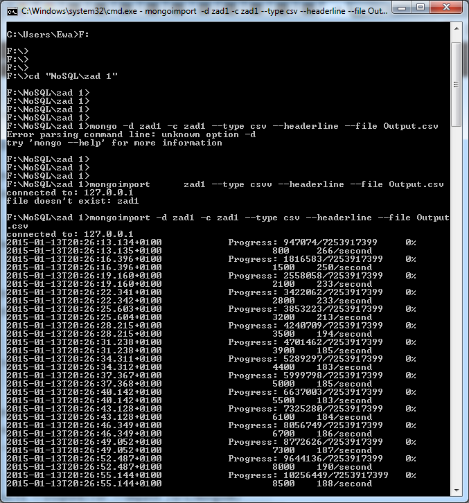

Pocatek pracy demona mongod

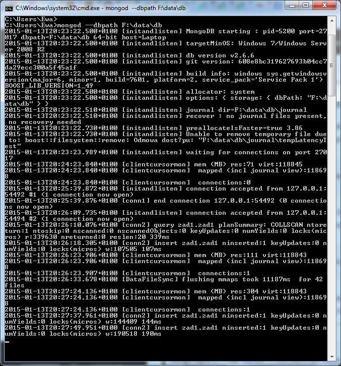

Import trwał ok. 40 min. na procesorze i5 3230 czterordzeniowym taktowanym na 2.6 Ghz oraz dyskiem SSD i 8 GB pamięci DDR3.

->1b

Liczba zliczonych dokumentów:

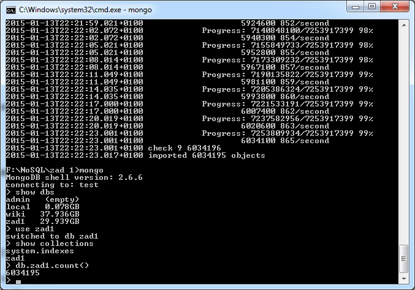

->1c
Zamiana tagow na tablicę napisów z tagami w jezyku Java (poprzednio zostal pobrany sterownik dla Javy):
```
    mongoklient = new MongoClient("localhost", 27017);
    DB db = mongoklient.getDB("zad1");
    final DBCollection zad1 = db.getCollection("zad1");
    zad1.find().forEach(new Consumer<DBObject>() {
        @Override
        public void accept(DBObject dbObject) {
            dbObject.put("Tags", dbObject.get("Tags").toString().split(" "));
            zad1.save(dbObject);
        }
    });
    mongoklient.close();
```

Nastepnie zostaly zliczone wszystkie tagi za pomoca skryptu js

```
mongo
db.zad1.aggregate([
  {$project: { _id: 0, Tags: 1 } },
  {$unwind: "$Tags" },
  {$group: { _id: null, count: { $sum: 1 } } }
])
```
Wszystkich tagow bylo:

```
17409994
```
Unikalne tagi zostaly policzone za pomoca agregacji

```
db.zad1.aggregate([
  {$project: { _id: 0, Tags: 1 } },
  {$unwind: "$Tags" },
  {$group: { _id: "$Tags", count: { $sum: 1 } } }
  {$group: { _id: null, count: { $sum: 1 } } }
])

```

a ich wszystkich bylo 

````
42048
```

Wszystkie te pliki js byly wykonywane na bazie danych zad1 w ponizszy sposob:

```
mongo 127.0.0.1:27017/zad1 tags.js
```
Najrzadziej wystepujace tagi:

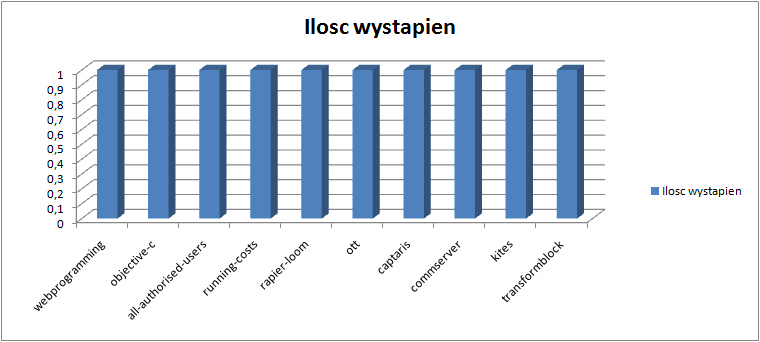

I najczesciej wystepujace Tagi to:

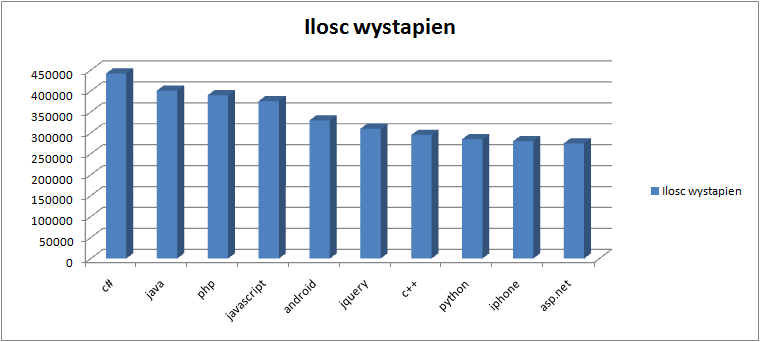


-> 1d

Do przetworzenia zostały wykorzystane dane geojson, ktore zostaly znalezione na stronie Gaeromed Db,
przedstawiajace placowki w roznych miastach.


Import
```
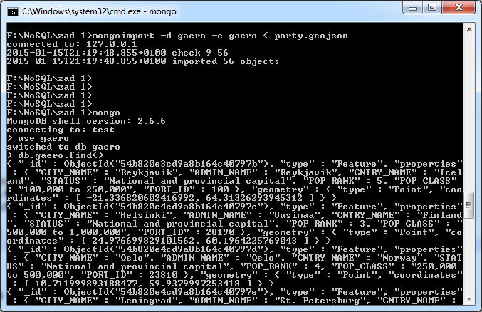
```

Wyszukałem 5 najbliższych placowek od Warszawy. W tym celu,
został wykorzystany poniższy skrypt.
```
db.gaero.ensureIndex({"geometry" : "2dsphere"})
var warsaw = {type: "Point", coordinates: [ 21.011878967285156, 52.244945526123047 ]}
wynik=db.gaero.find({ geometry: {$near: {$geometry: warsaw}} }).skip(1).limit(5)
db.wynikgeo.insert(wynik.toArray())
```

Wynik dzialania skryptu:

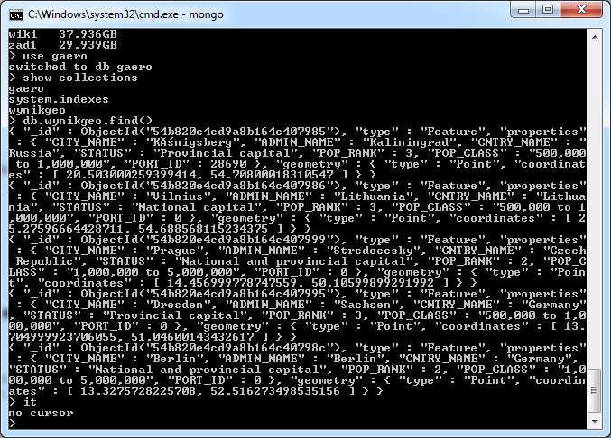

Wynik został eksportowany do pliku .json, przerobiony za pomocą jq na .geojson i wysłany na githuba.
Wynik znajduje się w poniższym linku:

Geo [geowynik](https://github.com/MajkelMatusaf/mapka/blob/master/1zap.geojson)

Kolejne zapytanie dotyczylo znalezienia placowek odleglych o 1000 km od Warszawy

W tym celu zostal napisany naspujacy skrypt:
```
db.gaero.ensureIndex({"geometry" : "2dsphere"})
var warsaw = {type: "Point", coordinates: [ 21.011878967285156, 52.244945526123047 ]}
wynik=db.gaero.find( { geometry : { $near :{ $geometry :warsaw,  $maxDistance : 1000000 }}})
db.wynikgeo2.insert(wynik.toArray())
```

Wynik dzialania skryptu (mapka na githubie):

Geo[geowynik2](https://github.com/MajkelMatusaf/mapka/blob/master/1000km.geojson)

Kolejne query miało na celu znalezienie miast niemieckich (Polygon ):

```
db.gaero.ensureIndex({"geometry" : "2dsphere"})
db.wynikgeo3.insert(db.gaero.find({geometry: {$geoWithin: {$geometry: {type : "Polygon" ,coordinates: [ [ [ 6, 55 ], [ 15, 55 ], [ 15, 47 ], [ 6, 47 ],[ 6, 55 ] ] ]}}}}))
```
Geo[geowynik3](https://github.com/MajkelMatusaf/mapka/blob/master/germany.geojson)


<h1>Zadanie 2 - agregacje </h2>

Dane zostały zaimportowane do mongodb:

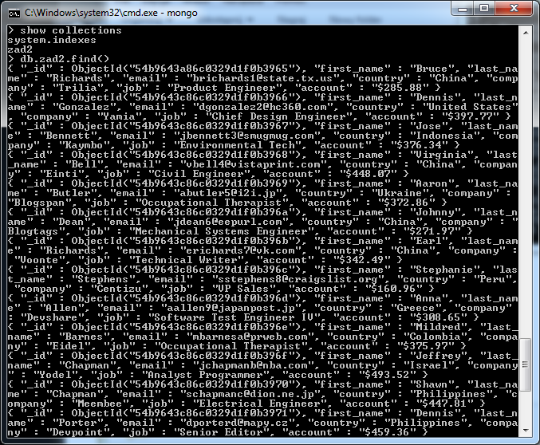

Dane znalezionie w sieci zawierały listę osób z ich danymi. Wycinek z znalezionych danych:
```
{"first_name":"Matthew","last_name":"Medina","email":"mmedina6h@de.vu","country":"China","company":"Devpoint","job":"Sales Associate","account":"$118.22"},
{"first_name":"Elizabeth","last_name":"Martin","email":"emartin6i@exblog.jp","country":"Spain","company":"Skiptube","job":"Senior Developer","account":"$178.54"},
{"first_name":"Jerry","last_name":"Harris","email":"jharris6j@nhs.uk","country":"China","company":"Trudeo","job":"Director of Sales","account":"$130.26"},
{"first_name":"Ronald","last_name":"Phillips","email":"rphillips6k@webmd.com","country":"Germany","company":"Thoughtmix","job":"VP Sales","account":"$499.44"},
{"first_name":"Sara","last_name":"Kelly","email":"skelly6l@bbc.co.uk","country":"Brazil","company":"Flipopia","job":"Nurse","account":"$167.33"},
```

Pierwsza agregacja dotyczyła policzenia osob z roznych krajow:

db.zad2.aggregate([
    { $group: { _id: "$country", ilosc: {$sum: 1}} },
    { $sort: {ilosc: -1 } },
    { $project: { Country: "$_id", ilosc: "$ilosc", _id: 0} }
])

Wynik: 
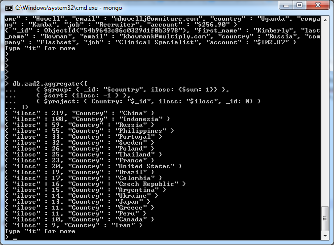

Kolejna agregacja miała na celu znalezenie osob z Polski

```
db.zad2.aggregate([
     { $match : { country : "Poland" } }
])
```
Wynik:
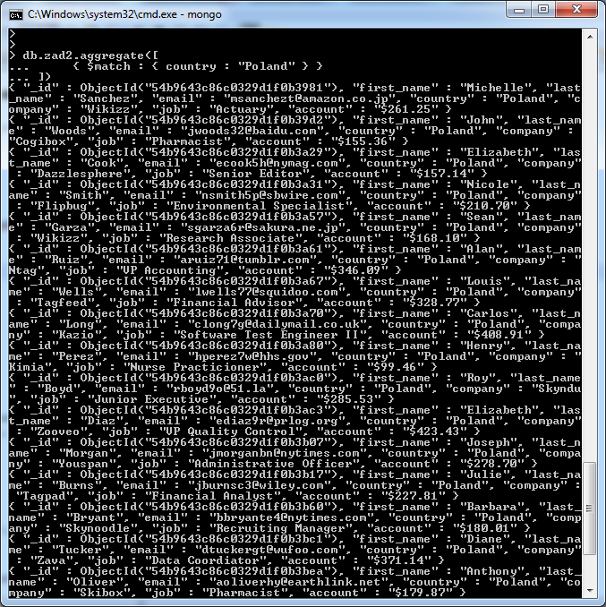

Osoby ktore maja na koncie więcej niż 200$:
```
db.zad2.aggregate(
   [
     {
       $project:
          {
            last_name: 1,
            account: 1,
            pow200: { $gte: [ "$account", 200 ] },
            _id: 0
          }
     }
   ]
)
```

Wynik:
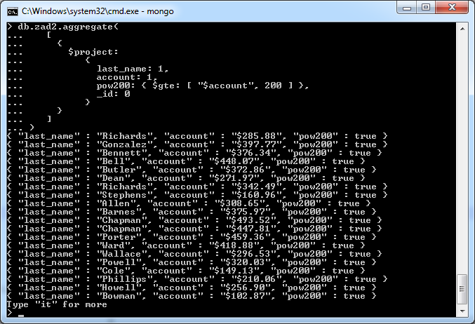

Policzenie najczescie wystepujacych imion:

```
db.zad2.aggregate([
    { $group : {_id : "$first_name", imie : { $sum : 1 }}},
    { $sort : {imie : -1}}
])
```
Wynik:
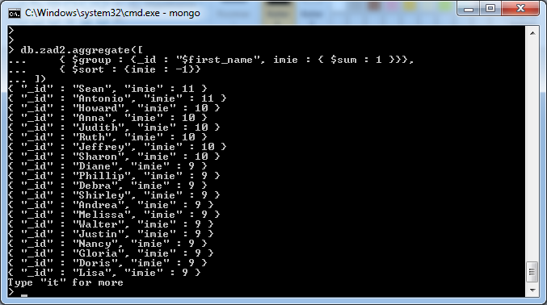

Ostatnia agregacja miała na celu posortowanie nazwisk alfabetycznie:
```
db.zad2.aggregate([
     { $project :  { last_name : "$last_name" } },
     { $group : { _id : {last_name:"$last_name"}  } },
     { $sort : { "_id.last_name" : 1 } },
     { $limit : 30}
])
```

Wynik:
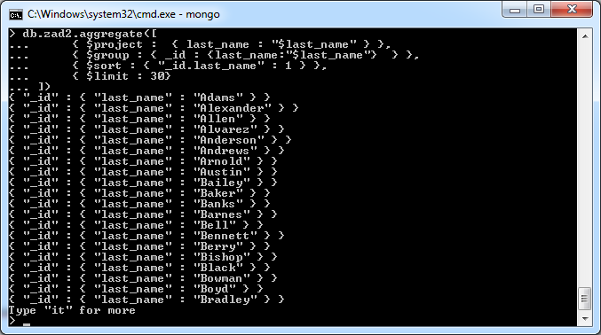
